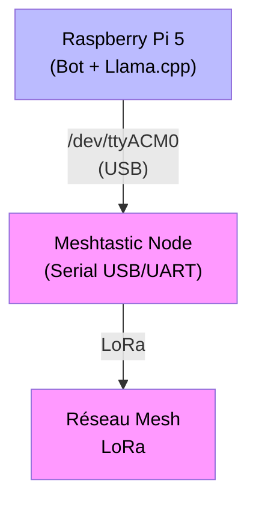
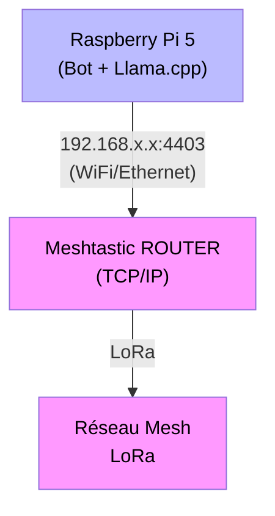

# Bot Meshtastic-Llama

Bot pour réseau Meshtastic (+ Telegram, optionnel) avec intégration Llama et fonctionnalités avancées.

## Architectures supportées

Le bot fonctionne en **mode single-node** : une seule connexion au réseau Meshtastic, soit via USB/UART (Serial), soit via TCP/IP (WiFi/Ethernet).

### Mode Serial (recommandé pour la plupart des utilisateurs)
Connexion directe via USB/UART - Configuration simple et stable



**Avantages** : Simple, stable, latence minimale  
**Inconvénient** : Node doit être proche du Raspberry Pi

### Mode TCP (pour placement optimal du node)
Connexion réseau - Le node peut être placé à distance (extérieur, meilleure antenne)



**Avantages** : Node peut être à distance, meilleur placement d'antenne  
**Inconvénients** : Configuration réseau requise, dépend de la stabilité WiFi/Ethernet

```markdown
## Fonctionnalités

- **Chat IA** : Intégration Llama via `/bot <question>`
- **Monitoring système** : `/sys` pour température CPU, RAM, uptime
- **Analyse réseau** : `/nodes` pour les nœuds directx entendus, `/my` pour signaux personnels
- **Stats réseau** : `/histo` pour la répartition en histogramme des paquets entendus, `/stats` ou `/packets` ou `/top` pour d'autres stats
- **Données ESPHome** : `/power` pour télémétrie solaire/batterie
- **Administration** : Commandes cachées pour gestion à distance

- genère une carte HMTL/JS des nodes, et une pour les links neighbours (dossier /map, autonome du bot)

- Pour compiler/installer llama.cpp sur le Raspberry Pi 5,
  voir le fichier https://github.com/Tigro14/meshbot/blob/main/llama.cpp-integration/READMELLAMA.md

## Installation

### Prérequis

**Système :**
- Python 3.8+ (testé sur Python 3.11-3.13)
- Raspberry Pi 5 recommandé (fonctionne sur autres Linux)
- Llama.cpp en cours d'exécution (voir [READMELLAMA.md](llama.cpp-integration/READMELLAMA.md))
- ESPHome (optionnel pour télémétrie solaire/batterie)

**Dépendances système (apt) :**
```bash
# Headers Python (requis pour pygeohash)
sudo apt-get install python3-dev

# Optionnel : outils de développement
sudo apt-get install git python3-pip python3-venv
```

### Installation des dépendances Python

**Méthode 1 : Depuis requirements.txt (recommandé)**
```bash
# Cloner le repository
git clone https://github.com/Tigro14/meshbot.git
cd meshbot

# Installer les dépendances
pip install -r requirements.txt --break-system-packages

# Note: --break-system-packages nécessaire sur Raspberry Pi OS
# et autres systèmes avec pip géré par le système
```

**Méthode 2 : Installation manuelle**
```bash
pip install meshtastic pypubsub requests python-telegram-bot \
    vigilancemeteo paho-mqtt pygeohash --break-system-packages
```

### Configuration

1. **Copier le template de configuration**
   ```bash
   cp config.py.sample config.py
   ```
   
   **OU** utiliser un exemple prêt à l'emploi :
   ```bash
   # Pour mode Serial (connexion USB)
   cp config.serial.example config.py
   
   # Pour mode TCP (connexion réseau)
   cp config.tcp.example config.py
   ```

2. **Éditer `config.py` avec vos paramètres**

   **Mode de connexion (CONNECTION_MODE)**
   
   Le bot supporte maintenant deux modes de connexion au réseau Meshtastic :
   
   - **Mode Serial (défaut)** : Connexion via port série USB/UART
     ```python
     CONNECTION_MODE = 'serial'
     SERIAL_PORT = "/dev/ttyACM0"  # Adapter selon votre port
     ```
   
   - **Mode TCP** : Connexion réseau à un node ROUTER accessible en WiFi/Ethernet
     ```python
     CONNECTION_MODE = 'tcp'
     TCP_HOST = "192.168.1.38"  # IP du node Meshtastic
     TCP_PORT = 4403            # Port TCP (défaut: 4403)
     ```
   
   **Autres paramètres importants :**
   - Token Telegram (`TELEGRAM_BOT_TOKEN`) si intégration Telegram
   - Département pour vigilance météo (`VIGILANCE_DEPARTEMENT`)
   - Configuration AI Llama (host, port, prompts)
   - Autres paramètres selon besoins

3. **Lancer le bot**
   ```bash
   python main_script.py
   ```

   Ou en mode debug :
   ```bash
   python main_script.py --debug
   ```

### Choix du mode de connexion

**Mode Serial (recommandé pour débutants)**
- ✅ Connexion directe et stable
- ✅ Pas de configuration réseau nécessaire
- ✅ Latence minimale
- ❌ Nécessite un câble USB
- ❌ Node doit être proche du Raspberry Pi

**Mode TCP (pour déploiements avancés)**
- ✅ Node peut être placé à distance (meilleure position pour antenne)
- ✅ Pas de câble USB nécessaire
- ✅ Permet l'utilisation d'un node ROUTER existant
- ❌ Nécessite configuration WiFi/Ethernet du node
- ❌ Dépend de la stabilité du réseau local
- ❌ Latence légèrement supérieure

**Exemple de cas d'usage TCP :**
```
Raspberry Pi 5 (intérieur, serveur)
        ↓ WiFi/Ethernet
Node Meshtastic ROUTER (extérieur, antenne optimale)
        ↓ LoRa
Réseau mesh Meshtastic
```

**Note pour utilisateurs avancés :**
L'architecture legacy multi-nodes (connexions Serial + TCP simultanées) reste supportée pour compatibilité. 
Consultez [MIGRATION_GUIDE.md](MIGRATION_GUIDE.md) pour plus de détails.

### Installation en tant que service systemd

Voir le fichier `meshbot.service` pour un exemple de service systemd.

```bash
# Copier le service
sudo cp meshbot.service /etc/systemd/system/

# Éditer les chemins si nécessaire
sudo nano /etc/systemd/system/meshbot.service

# Activer et démarrer
sudo systemctl daemon-reload
sudo systemctl enable meshbot
sudo systemctl start meshbot

# Vérifier les logs
journalctl -u meshbot -f
```

## Configuration du redémarrage à distance

Le bot dispose d'une commande cachée `/rebootpi` qui permet de redémarrer le Pi5 à distance.
Pour des raisons de sécurité, cette fonctionnalité utilise un système de fichier signal.

### 1. Script de surveillance

Créer le script `/usr/local/bin/rebootpi-watcher.sh` :

```bash
#!/bin/bash
# Script de surveillance pour redémarrage Pi via bot Meshtastic

SIGNAL_FILE="/tmp/reboot_requested"
LOG_FILE="/var/log/bot-reboot.log"

while true; do
    if [ -f "$SIGNAL_FILE" ]; then
        echo "$(date): Redémarrage Pi demandé via signal fichier" >> "$LOG_FILE"
        cat "$SIGNAL_FILE" >> "$LOG_FILE"
        rm -f "$SIGNAL_FILE"
        echo "$(date): Exécution du redémarrage Pi..." >> "$LOG_FILE"

        # Méthodes de redémarrage pour RPi5 (par ordre de préférence)
        # 1. systemctl (recommandé pour systemd)
        systemctl reboot || \
        # 2. shutdown avec délai court
        shutdown -r +1 "Redémarrage via bot" || \
        # 3. reboot direct
        /sbin/reboot || \
        # 4. sync + reboot forcé
        { sync; echo 1 > /proc/sys/kernel/sysrq; echo b > /proc/sysrq-trigger; }
    fi
    sleep 5
done
```

### 2. Service systemd pour permettre le reboot du Pi à distance

Créer le fichier `/etc/systemd/system/rebootpi-watcher.service` :

```ini
[Unit]
Description=Bot RebootPi Watcher
Documentation=https://github.com/votre-repo/meshtastic-bot
After=multi-user.target
StartLimitIntervalSec=0

[Service]
Type=simple
ExecStart=/usr/local/bin/rebootpi-watcher.sh
Restart=always
RestartSec=10
User=root
StandardOutput=journal
StandardError=journal

[Install]
WantedBy=multi-user.target
```

### 3. Activation du service

```bash
# Rendre le script exécutable
sudo chmod +x /usr/local/bin/rebootpi-watcher.sh

# Créer le fichier de log
sudo touch /var/log/bot-reboot.log
sudo chmod 644 /var/log/bot-reboot.log

# Recharger systemd
sudo systemctl daemon-reload

# Activer et démarrer le service
sudo systemctl enable rebootpi-watcher.service
sudo systemctl start rebootpi-watcher.service

# Vérifier le statut
sudo systemctl status rebootpi-watcher.service
```

### 4. Vérification

```bash
# Vérifier que le service est actif
sudo systemctl is-active rebootpi-watcher.service

# Consulter les logs du service
sudo journalctl -u rebootpi-watcher.service -f

# Tester le mécanisme (ATTENTION: redémarre le système!)
echo "Test manuel" > /tmp/reboot_requested
```

Proceder de même avec :

- https://github.com/Tigro14/meshbot/blob/main/meshbot.service pour le bot Mesh+Telegram
- https://github.com/Tigro14/meshbot/blob/main/llama.cpp-integration/llamacpp.service pour llama.cpp

### Sécurité

- La commande `/rebootpi` n'apparaît pas dans l'aide publique
- Tous les redémarrages sont tracés dans `/var/log/bot-reboot.log`
- Le fichier signal contient l'identité du demandeur
- Le service de surveillance fonctionne avec des privilèges root

### Logs de traçabilité

Le fichier `/var/log/bot-reboot.log` contient :
- Horodatage de la demande
- Identité du nœud Meshtastic demandeur
- ID hexadécimal du nœud pour traçabilité complète

## Serveur CLI (Interface en ligne de commande)

Le bot intègre un serveur TCP local permettant de se connecter via une interface CLI pour envoyer des commandes sans passer par le réseau Meshtastic. Utile pour le développement et le debug.

### Configuration

Dans `config.py` :

```python
# Activer le serveur CLI
CLI_ENABLED = True
CLI_SERVER_HOST = '127.0.0.1'  # Écoute locale uniquement (sécurité)
CLI_SERVER_PORT = 9999
```

### Utilisation

Le client CLI se connecte au bot via TCP sur localhost:9999 :

```bash
# Lancer le client CLI
python cli_client.py

# Ou avec des paramètres personnalisés
python cli_client.py --host 127.0.0.1 --port 9999
```

Une fois connecté, vous pouvez envoyer toutes les commandes du bot :

```
> /help
🤖 Bot:
[Affiche l'aide complète]

> /stats top 24 5
🤖 Bot:
📊 Top 5 talkers (24h)
...

> /trace F547F
🤖 Bot:
🔍 Node F547F
📶 Signal info...

> quit
👋 Disconnecting...
```

### Fonctionnalités

- **Pas de limite LoRa** : Pas de contrainte de 180 caractères
- **Pas de throttling** : Pas de limite de commandes/minute
- **Accès complet** : Toutes les commandes du bot disponibles
- **Pas de compétition série** : Le CLI ne touche pas au port `/dev/ttyACM0`
- **Historique des commandes** : Navigation avec ↑/↓ (comme bash), persistant entre sessions
- **Multi-client** : Plusieurs clients CLI peuvent se connecter simultanément (futur)

### Architecture

Le serveur CLI fonctionne en parallèle du bot principal :
- **Bot principal** : Écoute sur l'interface configurée (Serial ou TCP)
- **Serveur CLI** : Écoute sur `127.0.0.1:9999` (TCP local)
- **Aucune interférence** : Les deux systèmes sont indépendants

### Sécurité

- Écoute **uniquement** en local (`127.0.0.1`)
- Pas d'accès distant possible
- Idéal pour développement et debug local

## Commandes disponibles

### Commandes MESH
- `/bot <question>` - Chat avec l'IA
- `/power` - Données ESPHome (batterie, solaire, météo)
- `/weather [rain|astro] [ville] [days]` - Météo (par https://wttr.in)
  - `/weather` - Météo locale (géolocalisée)
  - `/weather Paris` - Météo d'une ville spécifique
  - `/weather rain` - Graphe précipitations aujourd'hui (sparklines haute résolution)
  - `/weather rain 3` - Graphe précipitations 3 jours
  - `/weather rain Paris` - Précipitations Paris (aujourd'hui)
  - `/weather rain Paris 3` - Précipitations Paris (3 jours)
  - `/weather astro` - Infos astronomiques (sunrise, sunset, moon 🌑🌕)
  - `/weather astro Paris` - Infos astronomiques Paris
  - `/weather help` - Afficher l'aide
- `/nodes [page]` - Liste des nœuds directs vus par votre node (paginé, trié par SNR)
- `/my` - Vos signaux vus par votre node (lookinglass)
- `/trace` - Traceroute de votre message vers le bot (hops, RSSI, SNR)
- `/trace <node>` - Afficher les infos signal d'un nœud spécifique (nom ou ID partiel)
- `/sys` - Informations système (CPU, RAM, uptime bot et OS)
- `/stats [sub]` - Statistiques unifiées avec sous-commandes :
  - `/stats` ou `/stats global` - Aperçu global du réseau
  - `/stats top [heures] [n]` - Top talkers (défaut: 24h, top 10)
  - `/stats packets [heures]` - Distribution des types de paquets
  - `/stats channel [heures]` - Utilisation du canal
  - `/stats histo [type] [heures]` - Histogramme par type
  - `/stats traffic [heures]` - Historique des messages publics (Telegram uniquement)
- `/top [heures]` - Alias pour `/stats top` (legacy)
- `/histo [type]` - Alias pour `/stats histo` (legacy)
- `/packets` - Alias pour `/stats packets` (legacy)
- `/trafic` - Trafic du mesh local sur les dernières heures
- `/echo <message>` - Diffuser un message via le node ROUTER
- `/annonce <message>` - Diffuser un message via le bot
- `/legend` - Légende des indicateurs de signal
- `/help` - Aide des commandes

### Commandes administration
- `/rebootpi <passwd>` - Redémarrage du Pi5 (nécessite configuration et autorisation)

### Les commandes specifiques Telegram
- le bot IA a plus de token et de contexte ca les restrictions sont moindre qu'en Mesh
- `/fullnodes` renvoie une liste complete de tous les nodes et signal en mémoire du node répéteur
- voir /help pour pour d'info

## Configuration

Le fichier `config.py` contient tous les paramètres configurables :
- Ports série et réseau
- Token telegram
- Limites de throttling
- Configuration des nœuds distants
- Paramètres d'affichage

## Limitations

- Throttling : 5 commandes par 5 minutes par utilisateur
- Messages limités à 180 caractères (contrainte LoRa)
- Nécessite llama.cpp en fonctionnement pour `/bot`
