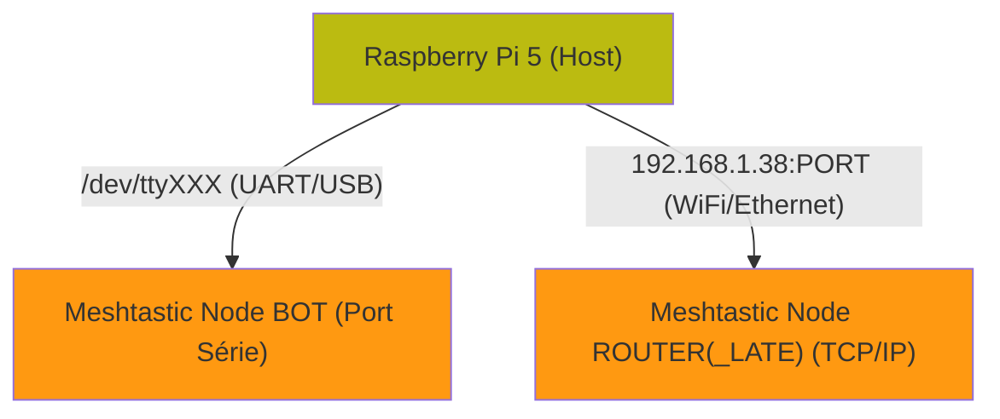

# Bot Meshtastic-Llama

Bot pour réseau Meshtastic (+ Telegram, optionel)  avec intégration Llama et fonctionnalités avancées.

Mon cas d'usage
- Un node Mesh ROUTER_LATE accessible en Wifi
- Un node Mesh bot connecté en série sur le RPi5



```markdown
## Fonctionnalités

- **Chat IA** : Intégration Llama via `/bot <question>`
- **Monitoring système** : `/sys` pour température CPU, RAM, uptime
- **Analyse réseau** : `/rx` pour les nœuds distants, `/my` pour signaux personnels
- **Données ESPHome** : `/power` pour télémétrie solaire/batterie
- **Administration** : Commandes cachées pour gestion à distance

- genère une carte HMTL/JS des nodes, et une pour les links neighbours (dossier /map, autonome du bot)

- Pour compiler/installer llama.cpp sur le Raspberry Pi 5, voir le fichier https://github.com/Tigro14/meshbot/blob/main/llama/READMELLAMA.md

## Installation

### Prérequis
- Python 3.8+
- Meshtastic Python library
- Llama.cpp en cours d'exécution
- ESPHome (optionnel)

### Configuration
1. Cloner le repository
2. Installer les dépendances : `pip install -r requirements.txt` #TODO
3. Configurer `config.py` avec vos paramètres
4. Lancer : `python main_script.py`

## Configuration du redémarrage à distance

Le bot dispose d'une commande cachée `/rebootpi` qui permet de redémarrer le Pi5 à distance. Pour des raisons de sécurité, cette fonctionnalité utilise un système de fichier signal.

### 1. Script de surveillance

Créer le script `/usr/local/bin/rebootpi-watcher.sh` :

```bash
#!/bin/bash
# Script de surveillance pour redémarrage Pi via bot Meshtastic

SIGNAL_FILE="/tmp/reboot_requested"
LOG_FILE="/var/log/bot-reboot.log"

while true; do
    if [ -f "$SIGNAL_FILE" ]; then
        echo "$(date): Redémarrage Pi demandé via signal fichier" >> "$LOG_FILE"
        cat "$SIGNAL_FILE" >> "$LOG_FILE"
        rm -f "$SIGNAL_FILE"
        echo "$(date): Exécution du redémarrage Pi..." >> "$LOG_FILE"
        
        # Méthodes de redémarrage pour RPi5 (par ordre de préférence)
        # 1. systemctl (recommandé pour systemd)
        systemctl reboot || \
        # 2. shutdown avec délai court
        shutdown -r +1 "Redémarrage via bot" || \
        # 3. reboot direct
        /sbin/reboot || \
        # 4. sync + reboot forcé
        { sync; echo 1 > /proc/sys/kernel/sysrq; echo b > /proc/sysrq-trigger; }
    fi
    sleep 5
done
```

### 2. Service systemd pour permettre le reboot du Pi à distance

Créer le fichier `/etc/systemd/system/rebootpi-watcher.service` :

```ini
[Unit]
Description=Bot RebootPi Watcher
Documentation=https://github.com/votre-repo/meshtastic-bot
After=multi-user.target
StartLimitIntervalSec=0

[Service]
Type=simple
ExecStart=/usr/local/bin/rebootpi-watcher.sh
Restart=always
RestartSec=10
User=root
StandardOutput=journal
StandardError=journal

[Install]
WantedBy=multi-user.target
```

### 3. Activation du service

```bash
# Rendre le script exécutable
sudo chmod +x /usr/local/bin/rebootpi-watcher.sh

# Créer le fichier de log
sudo touch /var/log/bot-reboot.log
sudo chmod 644 /var/log/bot-reboot.log

# Recharger systemd
sudo systemctl daemon-reload

# Activer et démarrer le service
sudo systemctl enable rebootpi-watcher.service
sudo systemctl start rebootpi-watcher.service

# Vérifier le statut
sudo systemctl status rebootpi-watcher.service
```

### 4. Vérification

```bash
# Vérifier que le service est actif
sudo systemctl is-active rebootpi-watcher.service

# Consulter les logs du service
sudo journalctl -u rebootpi-watcher.service -f

# Tester le mécanisme (ATTENTION: redémarre le système!)
echo "Test manuel" > /tmp/reboot_requested
```

- Proceder de même avec https://github.com/Tigro14/meshbot/blob/main/meshbot.service pour le bot Mesh+Telegram

- Proceder de même avec https://github.com/Tigro14/meshbot/blob/main/llama/llamacpp.service pour llama.cpp

### Sécurité

- La commande `/rebootpi` n'apparaît pas dans l'aide publique
- Tous les redémarrages sont tracés dans `/var/log/bot-reboot.log`
- Le fichier signal contient l'identité du demandeur
- Le service de surveillance fonctionne avec des privilèges root

### Logs de traçabilité

Le fichier `/var/log/bot-reboot.log` contient :
- Horodatage de la demande
- Identité du nœud Meshtastic demandeur
- ID hexadécimal du nœud pour traçabilité complète

## Commandes disponibles

### Commandes publiques MESH
- `/bot <question>` - Chat avec l'IA
- `/power` - Données ESPHome (batterie, solaire, météo)
- `/rx [page]` - Nœuds distants vus par tigrog2
- `/my` - Vos signaux vus par tigrog2
- `/sys` - Informations système (CPU, RAM, uptime)
- `/echo <message>` - Diffuser un message via tigrog2
- `/legend` - Légende des indicateurs de signal
- `/help` - Aide des commandes

### Commandes cachées (administration)
- `/rebootpi` - Redémarrage du Pi5 (nécessite configuration)
- `/rebootg2` - Redémarrage de tigrog2 + télémétrie
- `/g2` - Configuration et statistiques de tigrog2

### Les commandes depuis Telegram sont différentes
- le bot IA a plus de token et de contexte ca les restrictions sont moindre qu'en Mesh
- `/fullnodes` renvoie une liste complete de tous les nodes et signal en mémoire du node répéteur
- voir /help pour pour d'info

## Configuration

Le fichier `config.py` contient tous les paramètres configurables :
- Ports série et réseau
- Token telegram 
- Limites de throttling
- Configuration des nœuds distants
- Paramètres d'affichage

## Limitations

- Throttling : 5 commandes par 5 minutes par utilisateur
- Messages limités à 180 caractères (contrainte LoRa)
- Nécessite llama.cpp en fonctionnement pour `/bot`
