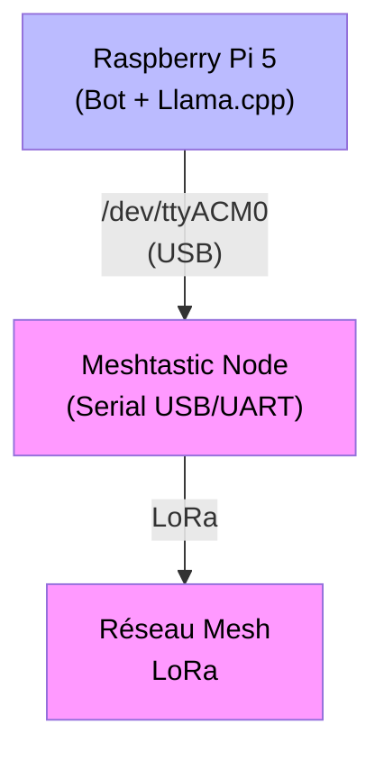
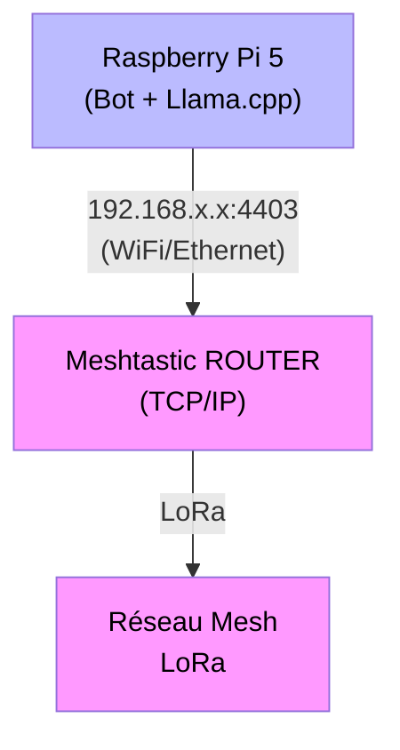
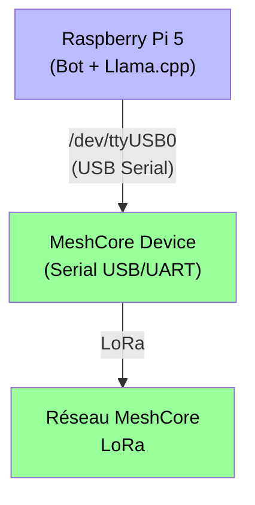
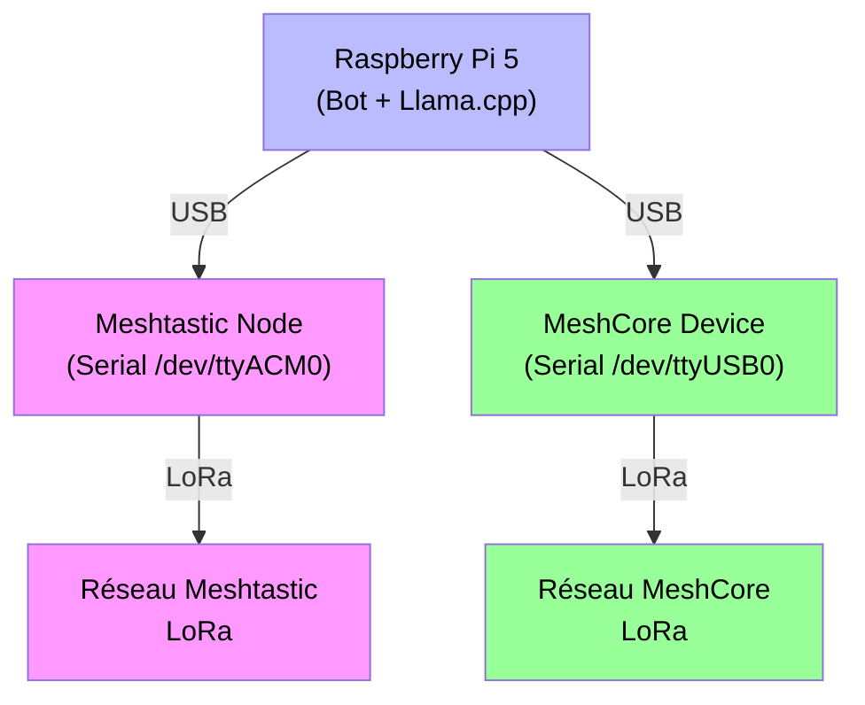

# Bot Meshtastic-Llama

Bot pour réseau Meshtastic (+ Telegram, optionnel) avec intégration Llama et fonctionnalités avancées.

## Architectures supportées

Le bot supporte plusieurs modes de fonctionnement :

### Mode Meshtastic Serial (recommandé)
Connexion directe via USB/UART - Configuration simple et stable



**Avantages** : Simple, stable, latence minimale  
**Inconvénient** : Node doit être proche du Raspberry Pi

### Mode Meshtastic TCP (placement optimal)
Connexion réseau - Le node peut être placé à distance (extérieur, meilleure antenne)



**Avantages** : Node peut être à distance, meilleur placement d'antenne  
**Inconvénients** : Configuration réseau requise, dépend de la stabilité WiFi/Ethernet

### Mode MeshCore Companion (NOUVEAU) 
Connexion série MeshCore uniquement - Bot fonctionnant sans Meshtastic

**⭐ Utilise la library officielle [meshcore-cli](https://github.com/fdlamotte/meshcore-cli) si disponible**



**Mode companion** : Le bot reçoit uniquement des DM (Direct Messages) via MeshCore
- ✅ Fonctionnalités disponibles : `/bot`, `/weather`, `/rain`, `/power`, `/sys`, `/help`, `/blitz`, `/vigilance`
- ❌ Fonctionnalités désactivées : `/nodes`, `/my`, `/trace`, `/neighbors`, `/stats` (requièrent Meshtastic)

**Installation** : 
```bash
pip install meshcore  # Library officielle (recommandé)
```

**Avantages** : Utilisation avec MeshCore, pas besoin de matériel Meshtastic, support protocole officiel  
**Inconvénients** : Fonctionnalités réseau Meshtastic non disponibles

**Configuration** : Voir `config.meshcore.example` pour un exemple complet

### Mode Dual-Network (NOUVEAU - AVANCÉ)
Connexions simultanées Meshtastic ET MeshCore - Bot présent sur DEUX réseaux mesh différents

**⭐ Mode le plus avancé : présence simultanée sur deux réseaux mesh indépendants**



**Cas d'usage** : Présence sur deux réseaux mesh distincts (ex: réseau communautaire principal + réseau expérimental secondaire)

**Prérequis** :
- ✅ Deux radios physiques connectées au Raspberry Pi
- ✅ Deux ports série distincts (ex: `/dev/ttyACM0` + `/dev/ttyUSB0`)
- ✅ **Fréquences différentes** sur les deux radios (obligatoire pour éviter interférences)
- ✅ MeshCore library installée (`pip install meshcore-cli`)

**Fonctionnalités** :
- ✅ Reçoit les messages des DEUX réseaux simultanément
- ✅ Statistiques agrégées des DEUX réseaux
- ✅ Toutes les commandes Meshtastic disponibles (car interface principale active)
- ✅ DMs MeshCore en parallèle
- ⚠️ Les réponses sont envoyées vers le réseau source du message

**Configuration** : Voir `config.dual.example` pour un exemple complet

**Activation** :
```python
# Dans config.py
DUAL_NETWORK_MODE = True      # Activer mode dual
MESHTASTIC_ENABLED = True     # Réseau Meshtastic actif
CONNECTION_MODE = 'serial'    # Mode serial pour Meshtastic
SERIAL_PORT = "/dev/ttyACM0"  # Port Meshtastic

MESHCORE_ENABLED = True           # Réseau MeshCore actif
MESHCORE_SERIAL_PORT = "/dev/ttyUSB0"  # Port MeshCore
```

**Avantages** : 
- Présence sur deux réseaux mesh distincts
- Portée étendue (combine deux réseaux)
- Redondance des communications
- Expérimentation avec MeshCore tout en gardant Meshtastic

**Inconvénients** : 
- Configuration complexe
- Nécessite deux radios physiques
- Requiert attention aux fréquences pour éviter interférences
- Consommation électrique plus élevée

**⚠️ Important** : Ce mode est **différent** du mode dual-node Meshtastic legacy (Serial+TCP sur même réseau). En mode dual-network, vous êtes sur **deux réseaux mesh complètement distincts**.

```markdown
## Fonctionnalités

- **Chat IA** : Intégration Llama via `/bot <question>`
- **Monitoring système** : `/sys` pour température CPU, RAM, uptime
- **Analyse réseau** : `/nodes` pour les nœuds directx entendus, `/my` pour signaux personnels, `/neighbors` pour topologie mesh
- **Stats réseau** : `/histo` pour la répartition en histogramme des paquets entendus, `/stats` ou `/packets` ou `/top` pour d'autres stats
- **Données ESPHome** : `/power` pour télémétrie solaire/batterie
- **Administration** : Commandes cachées pour gestion à distance
- **Collecte MQTT** : Collection automatique de topologie réseau via MQTT (au-delà de la portée radio)
- **Auto-récupération TCP** : Redémarrage automatique du node distant en cas d'échec de connexion (voir [TCP_AUTO_REBOOT.md](TCP_AUTO_REBOOT.md))
- **⭐ NOUVEAU : Watchdog I/O** : Surveillance santé du stockage avec reboot automatique via SysRq en cas de défaillance (voir [IO_HEALTH_TESTING.md](IO_HEALTH_TESTING.md))

- genère une carte HMTL/JS des nodes, et une pour les links neighbours (dossier /map, autonome du bot)

- Pour compiler/installer llama.cpp sur le Raspberry Pi 5,
  voir le fichier https://github.com/Tigro14/meshbot/blob/main/llama.cpp-integration/READMELLAMA.md

## Installation

### Prérequis

**Système :**
- Python 3.8+ (testé sur Python 3.11-3.13)
- Raspberry Pi 5 recommandé (fonctionne sur autres Linux)
- Llama.cpp en cours d'exécution (voir [READMELLAMA.md](llama.cpp-integration/READMELLAMA.md))
- ESPHome (optionnel pour télémétrie solaire/batterie)

**Dépendances système (apt) :**
```bash
# Headers Python (requis pour pygeohash)
sudo apt-get install python3-dev

# Optionnel : outils de développement
sudo apt-get install git python3-pip python3-venv
```

### Installation des dépendances Python

**Méthode 1 : Depuis requirements.txt (recommandé)**
```bash
# Cloner le repository
git clone https://github.com/Tigro14/meshbot.git
cd meshbot

# Installer les dépendances
pip install -r requirements.txt --break-system-packages

# Note: --break-system-packages nécessaire sur Raspberry Pi OS
# et autres systèmes avec pip géré par le système
```

**Méthode 2 : Installation manuelle**
```bash
pip install meshtastic pypubsub requests python-telegram-bot \
    beautifulsoup4 lxml paho-mqtt pygeohash --break-system-packages
```

### Configuration

**⚠️ NOUVEAU : Configuration séparée en deux fichiers**

La configuration est maintenant divisée en deux fichiers pour une meilleure sécurité :
- **config.py** : Paramètres publics (ports, fonctionnalités, limites)
- **config_priv.py** : Paramètres sensibles (tokens, mots de passe, IDs utilisateurs) - **gitignored**

1. **Copier les templates de configuration**
   ```bash
   cp config.py.sample config.py
   cp config.priv.py.sample config_priv.py
   ```
   
   **OU** utiliser un exemple prêt à l'emploi selon votre mode de fonctionnement :
   ```bash
   # Pour mode Serial (connexion USB Meshtastic)
   cp config.serial.example config.py
   cp config.priv.py.sample config_priv.py
   
   # Pour mode TCP (connexion réseau Meshtastic)
   cp config.tcp.example config.py
   cp config.priv.py.sample config_priv.py
   
   # Pour mode MeshCore Companion (MeshCore uniquement, sans Meshtastic)
   cp config.meshcore.example config.py
   cp config.priv.py.sample config_priv.py
   
   # Pour mode Dual-Network (Meshtastic + MeshCore simultanément - AVANCÉ)
   cp config.dual.example config.py
   cp config.priv.py.sample config_priv.py
   ```

2. **Éditer `config_priv.py` avec vos paramètres SENSIBLES**

   ```python
   # Token Telegram (obtenir via @BotFather)
   TELEGRAM_BOT_TOKEN = "1234567890:ABCdef..."
   
   # Utilisateurs autorisés (IDs Telegram)
   TELEGRAM_AUTHORIZED_USERS = [123456789]
   
   # Mot de passe pour commande /rebootpi
   REBOOT_PASSWORD = "your_secret_password"
   
   # Utilisateurs autorisés à rebooter
   REBOOT_AUTHORIZED_USERS = [123456789, 0x16fad3dc]
   
   # Mot de passe MQTT
   MQTT_NEIGHBOR_PASSWORD = "your_mqtt_password"
   ```

3. **Éditer `config.py` avec vos paramètres PUBLICS**

   **Modes de fonctionnement disponibles**
   
   Le bot supporte quatre modes de fonctionnement différents :
   
   1. **Mode Meshtastic Serial** (recommandé pour débutants)
      - Connexion USB directe à un node Meshtastic
      - Toutes les fonctionnalités disponibles
      
   2. **Mode Meshtastic TCP** (déploiements avancés)
      - Connexion réseau à un node Meshtastic distant
      - Toutes les fonctionnalités disponibles
      - Placement optimal de l'antenne
      
   3. **Mode MeshCore Companion** (sans Meshtastic)
      - Connexion série à un device MeshCore uniquement
      - Fonctionnalités limitées (pas d'accès aux stats réseau)
      - Voir section "Mode MeshCore Companion" ci-dessus
      
   4. **Mode Dual-Network** (AVANCÉ - deux réseaux simultanés)
      - Connexions simultanées Meshtastic ET MeshCore
      - Présence sur deux réseaux mesh distincts
      - Voir section "Mode Dual-Network" ci-dessus

   **Configuration Meshtastic (modes 1, 2, 4)**
   
   Le bot supporte deux modes de connexion au réseau Meshtastic :
   
   - **Mode Serial (défaut)** : Connexion via port série USB/UART
     ```python
     CONNECTION_MODE = 'serial'
     SERIAL_PORT = "/dev/ttyACM0"  # Adapter selon votre port
     ```
   
   - **Mode TCP** : Connexion réseau à un node ROUTER accessible en WiFi/Ethernet
     ```python
     CONNECTION_MODE = 'tcp'
     TCP_HOST = "192.168.1.38"  # IP du node Meshtastic
     TCP_PORT = 4403            # Port TCP (défaut: 4403)
     
     # Auto-reboot en cas d'échec de connexion (recommandé)
     TCP_AUTO_REBOOT_ON_FAILURE = True  # Redémarre le node si inaccessible
     TCP_REBOOT_WAIT_TIME = 45          # Attente après reboot (secondes)
     ```
     
     **Note:** Le mode TCP inclut désormais un système de récupération automatique. Si le node distant est inaccessible au démarrage (erreur "No route to host"), le bot tente automatiquement de le redémarrer via `meshtastic --reboot`. Voir [TCP_AUTO_REBOOT.md](TCP_AUTO_REBOOT.md) pour plus de détails.
   
   **Configuration MeshCore (modes 3, 4)**
   
   Pour activer le mode MeshCore :
   ```python
   # Mode MeshCore uniquement (mode 3)
   MESHTASTIC_ENABLED = False
   MESHCORE_ENABLED = True
   MESHCORE_SERIAL_PORT = "/dev/ttyUSB0"
   
   # Mode Dual-Network (mode 4)
   DUAL_NETWORK_MODE = True
   MESHTASTIC_ENABLED = True
   CONNECTION_MODE = 'serial'
   SERIAL_PORT = "/dev/ttyACM0"
   MESHCORE_ENABLED = True
   MESHCORE_SERIAL_PORT = "/dev/ttyUSB0"
   ```
   
   **Autres paramètres importants :**
   - Token Telegram (`TELEGRAM_BOT_TOKEN`) si intégration Telegram
   - Département pour vigilance météo (`VIGILANCE_DEPARTEMENT`)
   - Configuration AI Llama (host, port, prompts)
   - Autres paramètres selon besoins

4. **Lancer le bot**
   ```bash
   python main_script.py
   ```

**Exemple de cas d'usage Dual-Network :**
```
Raspberry Pi 5 (serveur)
    ├─ USB (/dev/ttyACM0) → Meshtastic → Réseau communautaire principal
    └─ USB (/dev/ttyACM1) → MeshCore → Réseau expérimental secondaire
```

**Note pour utilisateurs avancés :**
L'architecture legacy multi-nodes (connexions Serial + TCP simultanées sur même réseau Meshtastic) reste supportée pour compatibilité. 
Consultez [MIGRATION_GUIDE.md](MIGRATION_GUIDE.md) pour plus de détails.

### Installation en tant que service systemd

Voir le fichier `meshbot.service` pour un exemple de service systemd.

```bash
# Copier le service
sudo cp meshbot.service /etc/systemd/system/

# Éditer les chemins si nécessaire
sudo nano /etc/systemd/system/meshbot.service

# Activer et démarrer
sudo systemctl daemon-reload
sudo systemctl enable meshbot
sudo systemctl start meshbot

# Vérifier les logs
journalctl -u meshbot -f
```

## Configuration du redémarrage à distance

Le bot dispose d'une commande cachée `/rebootpi` qui permet de redémarrer le Pi5 à distance.
Pour des raisons de sécurité, cette fonctionnalité utilise un système de sémaphore en mémoire partagée.

**Note importante**: Le système utilise `/dev/shm` (mémoire partagée tmpfs) au lieu de `/tmp`.
Cela garantit que le signal de redémarrage fonctionne **même si le système de fichiers principal
devient read-only** (un problème courant sur Raspberry Pi avec des cartes SD défaillantes).

### 1. Script de surveillance

Créer le script `/usr/local/bin/rebootpi-watcher.sh` :

```bash
#!/bin/bash
# Script de surveillance pour redémarrage Pi via bot Meshtastic
# Utilise /dev/shm (tmpfs RAM) pour survivre aux filesystems read-only

LOCK_FILE="/dev/shm/meshbot_reboot.lock"
INFO_FILE="/dev/shm/meshbot_reboot.info"
LOG_FILE="/var/log/bot-reboot.log"

while true; do
    # Vérifier si le sémaphore de reboot est actif
    # On teste si le fichier lock existe et si on peut acquérir le lock
    if [ -f "$LOCK_FILE" ]; then
        # Tenter d'acquérir un lock exclusif (non-blocking)
        if ! flock -n -x "$LOCK_FILE" -c 'true' 2>/dev/null; then
            # Le lock est tenu = signal de reboot actif
            echo "$(date): Redémarrage Pi demandé via sémaphore (/dev/shm)" >> "$LOG_FILE"
            
            # Lire et logger les informations si disponibles
            if [ -f "$INFO_FILE" ]; then
                cat "$INFO_FILE" >> "$LOG_FILE"
            fi
            
            # Nettoyer les fichiers de signal
            rm -f "$LOCK_FILE" "$INFO_FILE" 2>/dev/null || true
            
            echo "$(date): Exécution du redémarrage Pi..." >> "$LOG_FILE"

            # Méthodes de redémarrage pour RPi5 (par ordre de préférence)
            # 1. systemctl (recommandé pour systemd)
            systemctl reboot || \
            # 2. shutdown avec délai court
            shutdown -r +1 "Redémarrage via bot" || \
            # 3. reboot direct
            /sbin/reboot || \
            # 4. sync + reboot forcé
            { sync; echo 1 > /proc/sys/kernel/sysrq; echo b > /proc/sysrq-trigger; }
        fi
    fi
    sleep 5
done
```

#### Alternative Python (recommandée)

Le bot inclut aussi une version Python plus robuste: `rebootpi-watcher.py`

Avantages de la version Python:
- ✅ Gestion d'erreurs plus complète
- ✅ Logs détaillés
- ✅ Shutdown gracieux (SIGTERM)
- ✅ Plus facile à maintenir et débugger

Pour utiliser la version Python, copiez le script:
```bash
sudo cp rebootpi-watcher.py /usr/local/bin/
sudo chmod +x /usr/local/bin/rebootpi-watcher.py
```

### 2. Service systemd pour permettre le reboot du Pi à distance

Créer le fichier `/etc/systemd/system/rebootpi-watcher.service` :

**Version Bash (simple):**
```ini
[Unit]
Description=Bot RebootPi Watcher (Bash)
Documentation=https://github.com/Tigro14/meshbot
After=multi-user.target
StartLimitIntervalSec=0

[Service]
Type=simple
ExecStart=/usr/local/bin/rebootpi-watcher.sh
Restart=always
RestartSec=10
User=root
StandardOutput=journal
StandardError=journal

[Install]
WantedBy=multi-user.target
```

**Version Python (recommandée):**
```ini
[Unit]
Description=Bot RebootPi Watcher (Python)
Documentation=https://github.com/Tigro14/meshbot
After=multi-user.target
StartLimitIntervalSec=0

[Service]
Type=simple
ExecStart=/usr/bin/python3 /usr/local/bin/rebootpi-watcher.py
Restart=always
RestartSec=10
User=root
StandardOutput=journal
StandardError=journal
WorkingDirectory=/home/votre-user/meshbot

[Install]
WantedBy=multi-user.target
```

**Note**: Ajustez `WorkingDirectory` pour pointer vers le répertoire du bot (nécessaire pour
importer `reboot_semaphore.py`).

### 3. Activation du service

```bash
# Rendre le script exécutable
sudo chmod +x /usr/local/bin/rebootpi-watcher.sh

# Créer le fichier de log
sudo touch /var/log/bot-reboot.log
sudo chmod 644 /var/log/bot-reboot.log

# Recharger systemd
sudo systemctl daemon-reload

# Activer et démarrer le service
sudo systemctl enable rebootpi-watcher.service
sudo systemctl start rebootpi-watcher.service

# Vérifier le statut
sudo systemctl status rebootpi-watcher.service
```

### 4. Vérification

```bash
# Vérifier que le service est actif
sudo systemctl is-active rebootpi-watcher.service

# Consulter les logs du service
sudo journalctl -u rebootpi-watcher.service -f

# Consulter le log fichier
sudo tail -f /var/log/bot-reboot.log

# Tester le mécanisme avec le module Python (SANS redémarrage réel)
python3 tests/test_reboot_semaphore.py

# Test complet du signal (ATTENTION: redémarre le système!)
# Version Python:
python3 << 'EOF'
from reboot_semaphore import RebootSemaphore
import time

info = {
    'name': 'TestManual',
    'node_id': '0xFFFFFFFF',
    'timestamp': time.strftime('%Y-%m-%d %H:%M:%S')
}
RebootSemaphore.signal_reboot(info)
print("Signal envoyé - Le système va redémarrer dans 5-10 secondes!")
EOF

# Ou version shell (si vous utilisez la version bash du watcher):
# sudo python3 -c "from reboot_semaphore import RebootSemaphore; RebootSemaphore.signal_reboot({'name': 'Test', 'node_id': '0xFF', 'timestamp': '2024-01-01 00:00:00'})"
```

**Note sur /dev/shm**: Le système utilise maintenant `/dev/shm/meshbot_reboot.lock` au lieu de 
`/tmp/reboot_requested`. Cela permet au signal de reboot de fonctionner **même si le système de
fichiers principal est en read-only** (problème fréquent sur RPi avec SD corrompue).

Proceder de même avec :

- https://github.com/Tigro14/meshbot/blob/main/meshbot.service pour le bot Mesh+Telegram
- https://github.com/Tigro14/meshbot/blob/main/llama.cpp-integration/llamacpp.service pour llama.cpp

### Sécurité

- La commande `/rebootpi` n'apparaît pas dans l'aide publique
- Tous les redémarrages sont tracés dans `/var/log/bot-reboot.log`
- Le fichier signal contient l'identité du demandeur
- Le service de surveillance fonctionne avec des privilèges root

### Logs de traçabilité

Le fichier `/var/log/bot-reboot.log` contient :
- Horodatage de la demande
- Identité du nœud Meshtastic demandeur
- ID hexadécimal du nœud pour traçabilité complète

## Watchdog I/O - Surveillance du stockage

Le bot intègre un système de surveillance de la santé du stockage (I/O health monitoring) qui détecte automatiquement les défaillances du système de fichiers et déclenche un redémarrage sécurisé via SysRq si nécessaire.

### Cas d'usage

Idéal pour les configurations avec stockage NVMe sur PCIe hat (modifié pour performance plutôt que fiabilité) :
- Détection précoce d'erreurs I/O avant perte système complète
- Redémarrage automatique sécurisé via séquence SysRq REISUB
- Amélioration de la disponibilité du service en environnement distant

### Fonctionnement

1. **Vérifications périodiques** : Après chaque cycle d'écriture SQLite (toutes les 5 minutes)
   - Test d'écriture léger sur filesystem (<1KB)
   - Vérification intégrité SQLite via PRAGMA
   - Suivi des défaillances consécutives

2. **Seuil de déclenchement** : 3 échecs consécutifs (~15 minutes)
   - Évite les faux positifs
   - Période de refroidissement de 15 minutes entre vérifications

3. **Reboot sécurisé** : Séquence SysRq REISUB si défaillance détectée
   - **R**eprendre contrôle clavier
   - **E**nvoyer SIGTERM (shutdown gracieux)
   - **I**nvoyer SIGKILL (forcer fermeture)
   - **S**ynchroniser filesystems
   - **U**nmount/remount lecture seule
   - **B**oot (redémarrage)

### Configuration

Dans `config.py` :

```python
# Activer/désactiver la surveillance I/O
IO_HEALTH_CHECK_ENABLED = True

# Nombre d'échecs consécutifs avant reboot (recommandé: 3)
IO_HEALTH_CHECK_FAILURE_THRESHOLD = 3

# Période de refroidissement entre vérifications (secondes)
IO_HEALTH_CHECK_COOLDOWN = 900  # 15 minutes
```

### Test et diagnostic

Un outil de diagnostic est fourni pour valider le fonctionnement :

```bash
# Tester la surveillance I/O
python3 diagnose_io_health.py

# Guide de test complet
cat IO_HEALTH_TESTING.md
```

### Logs et monitoring

Les événements I/O health sont enregistrés dans :
- **Bot logs** : `journalctl -u meshbot -f | grep "I/O Health"`
- **Watcher logs** : `/var/log/bot-reboot.log`

Exemple de log en cas de défaillance :
```
[ERROR] ⚠️ I/O Health: Health check failed (3/3)
[ERROR] 🚨 WATCHDOG TRIGGER: I/O health check failed 3 consecutive times
[ERROR] ✅ Reboot signalé au watchdog (rebootpi-watcher)
```

### Impact performance

Impact minimal sur les performances :
- **Fréquence** : 1 check toutes les 5-15 minutes
- **Durée** : ~100ms par vérification complète
- **Overhead** : <0.03% duty cycle

Pour plus de détails, voir [IO_HEALTH_TESTING.md](IO_HEALTH_TESTING.md).

## Serveur CLI (Interface en ligne de commande)

Le bot intègre un serveur TCP local permettant de se connecter via une interface CLI pour envoyer des commandes sans passer par le réseau Meshtastic. Utile pour le développement et le debug.

### Configuration

Dans `config.py` :

```python
# Activer le serveur CLI
CLI_ENABLED = True
CLI_SERVER_HOST = '127.0.0.1'  # Écoute locale uniquement (sécurité)
CLI_SERVER_PORT = 9999
```

### Utilisation

Le client CLI se connecte au bot via TCP sur localhost:9999 :

```bash
# Lancer le client CLI
python cli_client.py

# Ou avec des paramètres personnalisés
python cli_client.py --host 127.0.0.1 --port 9999
```

Une fois connecté, vous pouvez envoyer toutes les commandes du bot :

```
> /help
🤖 Bot:
[Affiche l'aide complète]

> /stats top 24 5
🤖 Bot:
📊 Top 5 talkers (24h)
...

> /trace F547F
🤖 Bot:
🔍 Node F547F
📶 Signal info...

> quit
👋 Disconnecting...
```

### Fonctionnalités

- **Pas de limite LoRa** : Pas de contrainte de 180 caractères
- **Pas de throttling** : Pas de limite de commandes/minute
- **Accès complet** : Toutes les commandes du bot disponibles
- **Pas de compétition série** : Le CLI ne touche pas au port `/dev/ttyACM0`
- **Historique des commandes** : Navigation avec ↑/↓ (comme bash), persistant entre sessions
- **Multi-client** : Plusieurs clients CLI peuvent se connecter simultanément (futur)

### Architecture

Le serveur CLI fonctionne en parallèle du bot principal :
- **Bot principal** : Écoute sur l'interface configurée (Serial ou TCP)
- **Serveur CLI** : Écoute sur `127.0.0.1:9999` (TCP local)
- **Aucune interférence** : Les deux systèmes sont indépendants

### Sécurité

- Écoute **uniquement** en local (`127.0.0.1`)
- Pas d'accès distant possible
- Idéal pour développement et debug local

## Commandes disponibles

### Commandes MESH
- `/bot <question>` - Chat avec l'IA
- `/power` - Données ESPHome (batterie, solaire, météo)
- `/weather [rain|astro] [ville] [days]` - Météo (par https://wttr.in)
  - `/weather` - Météo locale (géolocalisée)
  - `/weather Paris` - Météo d'une ville spécifique
  - `/weather rain` - Graphe précipitations aujourd'hui (sparklines haute résolution)
  - `/weather rain 3` - Graphe précipitations 3 jours
  - `/weather rain Paris` - Précipitations Paris (aujourd'hui)
  - `/weather rain Paris 3` - Précipitations Paris (3 jours)
  - `/weather astro` - Infos astronomiques (sunrise, sunset, moon 🌑🌕)
  - `/weather astro Paris` - Infos astronomiques Paris
  - `/weather help` - Afficher l'aide
- `/nodes [page]` - Liste des nœuds directs vus par votre node (paginé, trié par SNR)
- `/my` - Vos signaux vus par votre node (lookinglass)
- `/trace` - Traceroute de votre message vers le bot (hops, RSSI, SNR)
- `/trace <node>` - Afficher les infos signal d'un nœud spécifique (nom ou ID partiel)
- `/sys` - Informations système (CPU, RAM, uptime bot et OS)
- `/stats [sub]` - Statistiques unifiées avec sous-commandes :
  - `/stats` ou `/stats global` - Aperçu global du réseau
  - `/stats top [heures] [n]` - Top talkers (défaut: 24h, top 10)
  - `/stats packets [heures]` - Distribution des types de paquets
  - `/stats channel [heures]` - Utilisation du canal
  - `/stats histo [type] [heures]` - Histogramme par type
  - `/stats traffic [heures]` - Historique des messages publics (Telegram uniquement)
- `/top [heures]` - Alias pour `/stats top` (legacy)
- `/histo [type]` - Alias pour `/stats histo` (legacy)
- `/packets` - Alias pour `/stats packets` (legacy)
- `/trafic` - Trafic du mesh local sur les dernières heures
- `/echo <message>` - Diffuser un message sur le réseau mesh
- `/legend` - Légende des indicateurs de signal
- `/help` - Aide des commandes

### Commandes administration
- `/rebootpi <passwd>` - Redémarrage du Pi5 (nécessite configuration et autorisation)

### Les commandes specifiques Telegram
- le bot IA a plus de token et de contexte ca les restrictions sont moindre qu'en Mesh
- `/fullnodes` renvoie une liste complete de tous les nodes et signal en mémoire du node répéteur
- voir /help pour pour d'info


## 📖 Référence Complète des Commandes

Cette section contient la documentation exhaustive de toutes les commandes disponibles dans le bot Meshtastic-Llama. Pour une aide rapide, utilisez `/help` directement dans le bot.

### 🤖 Chat IA

#### `/bot <question>`
Conversation avec l'Intelligence Artificielle locale (Llama).

**Alias:** `/ia` (fonctionne de manière identique)

**Usage:**
- `/bot Explique-moi le protocole LoRa`
- `/bot Quelle est la météo actuelle?`

**Caractéristiques:**
- Contexte conversationnel maintenu pendant 30 minutes
- Maximum 6 messages dans l'historique de conversation
- Réponses adaptées au canal (plus détaillées sur Telegram que sur mesh)
- Mesh: max ~320 caractères, Telegram: max ~3000 caractères
- Protection système: bloqué si CPU > 60°C ou batterie < seuil

**Notes:**
- Le contexte est partagé entre Telegram et Mesh pour le même utilisateur
- Throttling: 5 commandes par 5 minutes par utilisateur

---

### ⚡ Système & Monitoring

#### `/power`
Affiche la télémétrie complète du système via ESPHome.

**Données affichées:**
- 🔋 Tension batterie (V)
- ☀️ Courant solaire (A) et puissance (W)
- 🌡️ Température (°C)
- 💧 Humidité (%)
- 📊 Pression atmosphérique (hPa)

**Usage:**
- `/power` - Affiche toutes les données disponibles

#### `/weather [options] [ville]`
Informations météorologiques complètes avec plusieurs modes.

**Modes disponibles:**
1. **Météo standard** (par défaut)
   - `/weather` - Météo locale (géolocalisée depuis le node)
   - `/weather Paris` - Météo d'une ville spécifique
   - `/weather London` - Fonctionne avec les villes internationales

2. **Précipitations** (`rain`)
   - `/weather rain` - Graphique pluie local (aujourd'hui)
   - `/weather rain 3` - Graphique pluie 3 jours
   - `/weather rain Paris` - Pluie Paris (aujourd'hui)
   - `/weather rain Paris 3` - Pluie Paris sur 3 jours
   - Format: Sparklines haute résolution (72 points/jour)
   - Échantillonnage: max-window pour préserver les pics de pluie

3. **Astronomie** (`astro`)
   - `/weather astro` - Infos astronomiques locales
   - `/weather astro Paris` - Infos Paris
   - Données: lever/coucher soleil, phase de lune 🌑🌕, midi solaire, UV index

4. **Éclairs** (`blitz`)
   - `/weather blitz` - Éclairs détectés dans les 15 dernières minutes
   - Rayon: 50km par défaut (configurable)
   - Source: Blitzortung.org via MQTT
   - Affiche: distance, polarité, timestamp

5. **Vigilance Météo-France** (`vigi`)
   - `/weather vigi` - État VIGILANCE actuel
   - Affiche: couleur (Vert/Jaune/Orange/Rouge), département
   - France uniquement (Météo-France)

**Alias:**
- `/rain [ville] [days]` - Équivalent à `/weather rain`
- `/vigi` - Équivalent à `/weather vigi`

#### `/sys`
Informations système du Raspberry Pi 5.

**Données affichées:**
- 🖥️ Usage CPU (%)
- 💾 Usage RAM (Mo/Go)
- 📊 Load average (1, 5, 15 min)
- ⏱️ Uptime système et bot
- 🌡️ Température CPU (si disponible)

#### `/graphs [heures]`
Graphiques historiques des capteurs ESPHome.

**Usage:**
- `/graphs` - Défaut: 24 heures
- `/graphs 12` - Graphiques sur 12 heures
- `/graphs 48` - Maximum: 48 heures

**Contenu:**
- Température (sparkline)
- Pression atmosphérique (sparkline)
- Format compact pour Meshtastic

---

### 📡 Réseau Meshtastic

#### `/nodes [page]`
Liste des nœuds du réseau (auto-détection du mode).

**Usage:**
- `/nodes` - Première page
- `/nodes 2` - Page suivante

**Modes:**
- **Meshtastic seul**: Liste des nœuds Meshtastic
- **MeshCore seul**: Liste des contacts MeshCore
- **Dual mode**: Affiche les deux réseaux

**Affichage:**
- Nom, ID court, signal (SNR/RSSI), distance, dernière réception

#### `/nodesmc [page|full]`
Liste des contacts MeshCore uniquement.

**Usage:**
- `/nodesmc` - Page 1 (7 contacts, filtre 30 jours)
- `/nodesmc 2` - Page 2
- `/nodesmc full` - Tous les contacts sans filtre temporel

**Affichage:**
- Nom, ID court, dernière réception
- Paginé pour compatibilité LoRa
- Données persistantes (base SQLite)

#### `/nodemt [page]`
Liste des nœuds Meshtastic directs uniquement.

**Usage:**
- `/nodemt` - Première page
- `/nodemt 2` - Page suivante

**Affichage:**
- Nœuds vus directement par le node
- Signal, distance, dernière réception

#### `/neighbors [node]`
Affiche la topologie des voisins mesh (relations NEIGHBORINFO).

**Usage:**
- `/neighbors` - Tous les voisins (format compact)
- `/neighbors tigro` - Voisins d'un nœud spécifique (par nom)
- `/neighbors F547F` - Voisins par ID partiel

**Données:**
- Relations de voisinage
- SNR de chaque lien
- Intervalle de broadcast du nœud
- Dernière réception

**Notes:**
- Données collectées via NEIGHBORINFO_APP
- Rétention: 30 jours (configurable)
- Source: radio directe + MQTT (si activé)

#### `/meshcore`
Statut de la connexion MeshCore (mode dual uniquement).

**Vérifications:**
- Port série configuré
- État de la connexion
- Threads actifs
- Derniers paquets reçus

**Usage:**
- Diagnostic "aucun paquet MeshCore reçu"
- Vérification santé connexion

#### `/info <node>`
Informations complètes sur un nœud spécifique.

**Usage:**
- `/info tigro` - Par nom de nœud
- `/info F547F` - Par ID court

**Données affichées:**
- Nom complet (LongName)
- ID court et ID complet
- Position GPS (si disponible)
- Distance depuis le bot
- Signal (SNR, RSSI)
- Statistiques mesh (paquets, types)
- Dernière réception

**Note:** Supporte broadcast pour partage d'infos publiques

#### `/keys [node]`
Diagnostique les clés publiques PKI (chiffrement DM Meshtastic 2.7.15+).

**Usage:**
- `/keys` - État global des clés (toutes les nodes)
- `/keys tigro` - Vérifier si "tigro" a échangé sa clé
- `/keys F547F` - Vérifier clé d'un nœud par ID

**Contexte:**
- Meshtastic 2.7.15+ chiffre tous les DM par défaut
- Chaque nœud a une paire clé publique/privée unique
- Les clés publiques doivent être échangées pour DM
- Aide à résoudre problème "ENCRYPTED" dans les DM

**Affichage:**
- Nœuds avec clé publique connue
- Nœuds sans clé (DM impossibles)
- Timestamp dernière mise à jour

#### `/mqtt [heures]`
Nœuds MQTT entendus directement via le collecteur MQTT.

**Usage:**
- `/mqtt` - Tous les nœuds (48h par défaut)
- `/mqtt 24` - Nœuds des dernières 24h

**Affichage:**
- LongName, ID court
- Temps écoulé depuis dernière réception
- Icônes: 🟢 <1h, 🟡 <24h, 🟠 >24h

**Source:**
- Collecte via MQTT NEIGHBORINFO_APP
- Permet visibilité au-delà de la portée radio directe

#### `/rx [node]`
Statistiques du collecteur MQTT et voisins d'un nœud.

**Usage:**
- `/rx` - Statistiques globales du collecteur MQTT
- `/rx tigro` - Voisins du nœud via MQTT/radio

**Données:**
- Nombre de nœuds découverts
- Relations de voisinage collectées
- Statistiques de collecte

#### `/propag [heures] [top]`
Plus longues liaisons radio (analyse de propagation).

**Usage:**
- `/propag` - Top 5 liaisons (24h)
- `/propag 48` - Top 5 liaisons (48h)
- `/propag 24 10` - Top 10 liaisons (24h)

**Critères:**
- Distance > seuil minimum
- Rayon: 100km depuis le bot (configurable)
- Données GPS requises des deux côtés

**Affichage:**
- Nœud A ↔ Nœud B
- Distance (km)
- Signal (SNR/RSSI)
- Qualité liaison

#### `/fullnodes [jours] [recherche]`
Liste alphabétique complète de tous les nœuds.

**Usage:**
- `/fullnodes` - Tous les nœuds (30j)
- `/fullnodes 7` - Nœuds des 7 derniers jours
- `/fullnodes tigro` - Nœuds contenant "tigro" (30j)
- `/fullnodes 7 tigro` - Nœuds "tigro" (7j)

**Caractéristiques:**
- Tri alphabétique par LongName
- Filtre temporel configurable (max 365j)
- Recherche par nom partiel
- Affiche: nom, ID, signal, distance, dernière réception

---

### 📊 Analyse Trafic

#### `/stats [cmd] [params]`
Système unifié de statistiques réseau.

**Sous-commandes:**

1. **`global`** (défaut)
   - `/stats` ou `/stats global` - Vue d'ensemble réseau
   - Affiche: total paquets, nœuds actifs, types prédominants

2. **`top [heures] [nombre]`**
   - `/stats top` - Top 10 talkers (24h)
   - `/stats top 48 20` - Top 20 talkers (48h)
   - Affiche: nœud, nombre paquets, pourcentage

3. **`packets [heures]`**
   - `/stats packets` - Distribution types de paquets (24h)
   - `/stats packets 48` - Distribution sur 48h
   - Types: TEXT, POSITION, TELEMETRY, NODEINFO, etc.

4. **`channel [heures]`**
   - `/stats channel` - Utilisation du canal (24h)
   - `/stats channel 48` - Utilisation sur 48h
   - Affiche: nœuds par activité, pourcentage d'utilisation

5. **`histo [type] [heures]`**
   - `/stats histo` - Histogramme temporel (tous types, 24h)
   - `/stats histo pos 48` - Histogramme POSITION (48h)
   - Types: all, messages, pos, info, telemetry

6. **`traffic [heures]`** (Telegram uniquement)
   - `/stats traffic 8` - Historique messages publics (8h)
   - Affiche: timestamp, nœud, message complet

7. **`hop [heures]`**
   - `/stats hop` - Top 20 nœuds par hop_start (24h)
   - `/stats hop 48` - Top 20 (48h)
   - Mesure: portée maximale du nœud

**Raccourcis:** g, t, p, ch, h, tr, hop

#### `/trafic [heures]`
Historique des messages publics (tous réseaux).

**Usage:**
- `/trafic` - Défaut: 8 heures
- `/trafic 24` - Maximum: 24 heures

**Affichage:**
- Timestamp [HH:MM:SS]
- Icône source (📻 Serial, �� TCP, 🔗 MeshCore)
- Nom nœud
- Message complet

**Limites:**
- Rétention: 24-48h (configurable)
- Max 2000 messages en mémoire

#### `/trafficmt [heures]`
Historique messages publics Meshtastic uniquement.

**Usage:**
- `/trafficmt 8` - Messages Meshtastic (8h)

**Sources filtrées:** 'local', 'tcp', 'tigrog2'

#### `/trafficmc [heures]`
Historique messages publics MeshCore uniquement.

**Usage:**
- `/trafficmc 8` - Messages MeshCore (8h)

**Source filtrée:** 'meshcore'

#### `/top [heures] [nombre]`
Top talkers (alias de `/stats top`).

**Usage:**
- `/top` - Défaut: top 10 (24h)
- `/top 48` - Top 10 (48h)
- `/top 24 20` - Top 20 (24h)

#### `/trace [node]`
Traceroute mesh vers un nœud.

**Usage:**
- `/trace` - Trace votre propre message vers le bot
- `/trace tigro` - Trace vers nœud spécifique (par nom)
- `/trace F547F` - Trace par ID partiel

**Affichage:**
- Chemin complet (hops)
- Signal à chaque hop (RSSI, SNR)
- Distance estimée
- Relays identifiés

#### `/hop [heures]`
Top 20 nœuds par portée maximale (alias de `/stats hop`).

**Usage:**
- `/hop` - Défaut: 24h
- `/hop 168` - Maximum: 7 jours

#### `/histo [type] [heures]`
Histogramme temporel (alias de `/stats histo`).

**Usage:**
- `/histo` - Tous types (24h)
- `/histo pos` - Paquets POSITION uniquement
- `/histo text 48` - Messages texte sur 48h

**Types:** all, messages, pos, info, telemetry

#### `/packets [heures]`
Distribution des types de paquets (alias de `/stats packets`).

**Usage:**
- `/packets` - Défaut: 24h
- `/packets 48` - Sur 48h

---

### 💾 Base de Données

#### `/db [commande] [params]`
Opérations sur la base de données SQLite.

**Sous-commandes:**

1. **`stats`**
   - `/db stats` - Statistiques base de données
   - Affiche: taille fichier, nombre d'entrées par table, âge des données

2. **`info`**
   - `/db info` - Informations détaillées
   - Affiche: schéma tables, indexes, statistiques avancées

3. **`clean [heures]`**
   - `/db clean` - Nettoyer données anciennes (48h par défaut)
   - `/db clean 72` - Nettoyer données > 72h
   - Supprime: paquets expirés, messages publics, statistiques

4. **`vacuum`**
   - `/db vacuum` - Optimiser la base de données (VACUUM)
   - Récupère espace disque
   - Réorganise les données

**Raccourcis:** s, i, v

**Notes:**
- Requiert autorisation
- Nettoyage automatique périodique (5 min)
- Vacuum manuel recommandé après gros nettoyage

---

### 📢 Diffusion

#### `/echo <message>`
Diffuse un message sur le réseau mesh actuel.

**Usage:**
- `/echo Bonjour à tous!` - Broadcast sur réseau actuel
- En mode dual: utilise le réseau dont provient la commande

**Caractéristiques:**
- Préfixe automatique avec votre nom
- Broadcast public via votre node
- Support Telegram vers mesh

#### `/echomt <message>`
Diffuse explicitement sur Meshtastic (mode dual uniquement).

**Usage:**
- `/echomt Message Meshtastic` - Force réseau Meshtastic

#### `/echomc <message>`
Diffuse explicitement sur MeshCore (mode dual uniquement).

**Usage:**
- `/echomc Message MeshCore` - Force réseau MeshCore

**Notes:**
- Isolation réseau : les commandes MC ne fonctionnent pas depuis MT et vice versa
- Voir `NETWORK_ISOLATION.md` pour détails

---

### ℹ️ Utilitaires

#### `/legend`
Affiche la légende des indicateurs de signal.

**Contenu:**
- Échelles SNR (Signal-to-Noise Ratio)
- Échelles RSSI (Received Signal Strength Indicator)
- Qualité des liens
- Interprétation des valeurs

#### `/help`
Affiche l'aide des commandes.

**Variantes:**
- **Mesh/MeshCore** : Aide compacte (~130 caractères)
- **Telegram** : Aide concise (~1200 caractères)
- **README.md** : Documentation complète (cette section)

---

### 🔧 Administration

*Ces commandes nécessitent une autorisation spéciale (voir configuration).*

#### `/rebootpi [mot_de_passe]`
Redémarre le Raspberry Pi 5.

**Usage:**
- `/rebootpi <password>` - Redémarrage avec mot de passe

**Sécurité:**
- Double authentification (ID utilisateur + mot de passe)
- Liste d'utilisateurs autorisés
- Audit trail complet dans les logs
- Commande cachée (non listée dans `/help`)

**Mécanisme:**
- Utilise semaphore dans `/dev/shm` (survit au filesystem read-only)
- Script systemd surveille le signal
- Reboot effectué par service privilégié

#### `/rebootnode [nom] [mot_de_passe]`
Redémarre un nœud Meshtastic distant.

**Usage:**
- `/rebootnode tigro <password>` - Redémarre nœud "tigro"

**Sécurité:** Identique à `/rebootpi`

#### `/cpu`
Monitoring CPU en temps réel pendant 10 secondes.

**Affichage:**
- Usage CPU instantané (%)
- Température processeur
- Load average
- Rafraîchissement toutes les 2 secondes

---

### 📋 Informations & Limites

#### Throttling
- **Limite:** 5 commandes par période de 5 minutes par utilisateur
- **Scope:** Par utilisateur (ID Telegram ou Node Meshtastic)
- **Message:** "⏳ Limite atteinte. Attendre X secondes"

#### Contexte IA
- **Historique:** Maximum 6 messages (3 échanges)
- **Timeout:** 30 minutes d'inactivité
- **Scope:** Partagé entre Telegram et Mesh pour même utilisateur

#### Messages
- **LoRa/Mesh:** Maximum ~180 caractères par message
- **Telegram:** Maximum ~4000 caractères
- **Chunking:** Messages longs automatiquement découpés

#### Rétention Données
- **Paquets:** 48 heures (configurable)
- **Messages publics:** 24-48 heures, max 2000 en mémoire
- **Neighbors:** 30 jours
- **Nodes:** Variable selon configuration

#### Base de Données
- **Moteur:** SQLite
- **Emplacement:** `traffic_history.db`
- **Nettoyage:** Automatique toutes les 5 minutes
- **Tables:** packets, public_messages, node_stats, neighbors, global_stats

---

### 💡 Astuces & Best Practices

1. **Économiser la bande passante LoRa:**
   - Utilisez les alias courts: `/ia` au lieu de `/bot`
   - Préférez `/top` à `/stats top` sur mesh
   - Utilisez les filtres temporels courts: `/trafic 2` au lieu de `/trafic 24`

2. **Diagnostic réseau:**
   - `/meshcore` en premier pour vérifier connexion MeshCore
   - `/keys` pour problèmes de DM chiffrés
   - `/trace` pour analyser le chemin et les relays
   - `/neighbors` pour voir la topologie

3. **Analyse d'activité:**
   - `/fullnodes 7` pour vue hebdomadaire
   - `/propag` pour identifier les meilleures liaisons
   - `/stats hop` pour voir les nœuds les plus éloignés

4. **Météo:**
   - `/weather rain 3` pour planifier sorties
   - `/weather blitz` avant activités extérieures
   - `/weather vigi` pour alertes Météo-France

5. **Telegram vs Mesh:**
   - Réponses plus longues et détaillées sur Telegram
   - Pas de limite de caractères sur Telegram
   - Contexte IA partagé entre les deux

6. **Mode Dual:**
   - Utilisez `/echomt` et `/echomc` pour cibler un réseau
   - Les commandes réseau-spécifiques sont isolées
   - Voir `NETWORK_ISOLATION.md` pour détails

---

### 🔐 Sécurité & Traçabilité

- **Authentification:** Liste d'utilisateurs autorisés (Telegram ID, Meshtastic Node ID)
- **Logs:** Toutes les commandes sont tracées avec timestamp et identité
- **Redémarrages:** Incluent l'identité du demandeur
- **Audit:** `/var/log/bot-reboot.log` pour historique redémarrages
- **Isolation:** Commandes réseau strictement séparées (MT vs MC)

---

### 🆘 Dépannage

#### "❌ REMOTE_NODE_HOST non configuré"
- **Cause:** Ancienne version du code echo
- **Solution:** Mise à jour vers version avec interface partagée

#### "🚫 Commande réservée au réseau MeshCore"
- **Cause:** Commande MC appelée depuis réseau MT
- **Solution:** Utiliser commande équivalente MT (`/nodemt` au lieu de `/nodesmc`)

#### "📭 Aucun message public dans les Xh"
- **Cause:** Aucune activité sur le réseau
- **Solution:** Vérifier connexion réseau, augmenter période

#### "Erreur: Traffic monitor non disponible"
- **Cause:** Module de statistiques non initialisé
- **Solution:** Vérifier configuration, redémarrer bot

#### "⏳ Limite atteinte"
- **Cause:** Throttling activé (5 cmd/5min)
- **Solution:** Attendre ou contacter administrateur

---

### 📚 Documentation Complémentaire

- **[CLAUDE.md](CLAUDE.md)** - Guide développeur complet (pour IA et contributeurs)
- **[NETWORK_ISOLATION.md](NETWORK_ISOLATION.md)** - Isolation réseau MT/MC
- **[ECHO_COMMANDS_UPDATE.md](ECHO_COMMANDS_UPDATE.md)** - Commandes echo réseau-spécifiques
- **[TRAFFIC_COMMANDS_UPDATE.md](TRAFFIC_COMMANDS_UPDATE.md)** - Commandes traffic réseau-spécifiques
- **[docs/archive/](docs/archive/)** - Documentation historique (412 fichiers)

## Configuration

Le fichier `config.py` contient tous les paramètres configurables :
- Ports série et réseau
- Token telegram
- Limites de throttling
- Configuration des nœuds distants
- Paramètres d'affichage


## Limitations

- Throttling : 5 commandes par 5 minutes par utilisateur
- Messages limités à 180 caractères (contrainte LoRa)
- Nécessite llama.cpp en fonctionnement pour `/bot`

---

## Documentation

### Quick Start
- **This file (README.md)**: Setup and user guide
- **[CLAUDE.md](CLAUDE.md)**: Comprehensive developer guide (for AI assistants and contributors)

### Historical Documentation
Over **412 archived documentation files** are available in `docs/archive/` for historical reference. See **[docs/archive/README.md](docs/archive/README.md)** for details.

---

## Crédits

Bot vibecodé par Tigro14. Intégration Llama, Telegram, ESPHome, statistiques avancées, et bien plus.

